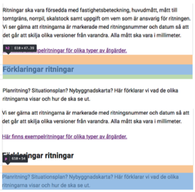
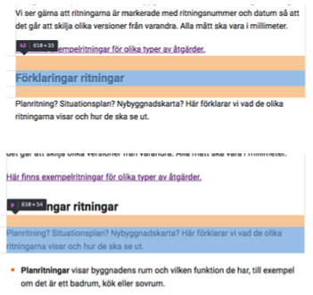
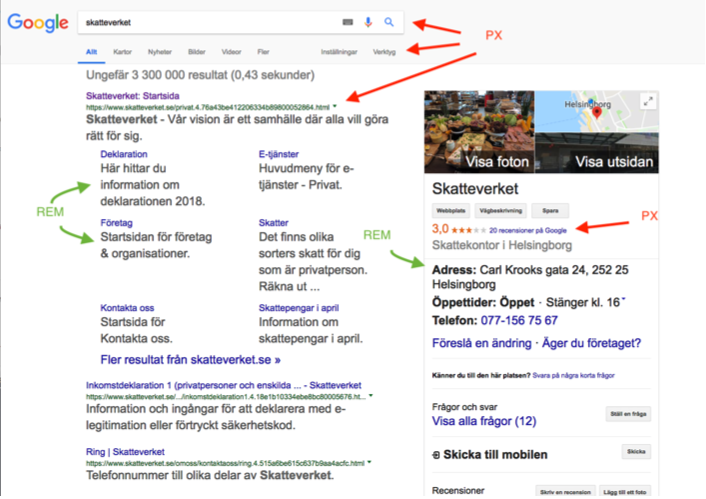

# CSS code guidelines.

eslint:recommended

Standard : BEM

------
## Filestructure/Layers
#### Based on ITCSS


------

## Layers

#### Settings
Globally used variables like colors, font, sizing etc. This layer do not output any css.

#### Tools
Globally used mixins and functions. This layer do not output any css.

#### Generic
Reset and/or normalize styles, box-sizing definition, etc. First layer which generates actual CSS.

#### Elements
Styling for bare HTML elements (like H1, A, etc.). These come with default styling from the browser so we can redefine them here.

#### Objects
Abstract styles (animation, box-shadow, layout, containers etc) that can be re-used across the project. Objects should in general never be modified as they effect a wide range of UI components.

#### Components
Specific UI components (like button, navigation, footer etc). This is where majority of our work takes place and our UI components are often composed of Objects and Components.

#### Utility
Utilities and helper classes with ability to override anything which goes before in the triangle, eg. hide helper class

------

## Inverted triangle


------

## 8-point Grid


Picture borrowed from: https://builttoadapt.io/intro-to-the-8-point-grid-system-d2573cde8632

------

## Naming convention: BEM
* All classes can be categorized as either a block, element or modifier
* Syntax: .block__element—modifier
* Block - Standalone entity that is meaningful on its own.
* Element - A part of a block that has no standalone meaning and is semantically tied to its block.
* Modifier - A flag on a block or element. Use them to change appearance or behavior.
* http://getbem.com/introduction/

------

## BEM - Guidelines
* A block can contain other blocks
* Explains relationship between styles
* Modularize styles to keep it DRY

-----

## BEM - Elements

#### Don't
```html
<div class=”card”>
    <div class=”card__body”>
        <h4 class=”card__body__title”>Title</h4>
    </div>
</div>
```


#### Do
```html
<div class=”card”>
    <div class=”card__body”>
        <h4 class=”card__title”>Title</h4>
    </div>
</div>
```

-----

## BEM - Modifiers

#### Do
```html
<div class=”card card--blue”>
    <div class=”card__body”>
        <h4 class=”card__title”>Title</h4>
    </div>
</div>
```

#### Do
```html
<div class=”card”>
    <div class=”card__body”>
        <h4 class=”card__title card__title--blue”>Title</h4>
    </div>
</div>
```
----

## Introducing Namespaces BEM + ITCSS = BEMIT
#### BEM:
.block__element—modifier

#### BEM w/ Namespaces:
.namespace-block__element--modifier {}

#### BEM w/ Namespaces & Responsive Suffixes:
.namespace-block__element--modifier\@suffix {}

----

## Namespaces

##### o-, Object
``` .o-object-name[<element>|<modifier>] {}```

##### c-, Component
```.c-component-name[<element>|<modifier>] {}```

##### u-, Utility
```.u-utility-name {}```

##### t-, Theme
```.t-theme-name {}```

##### s-, Scope
```.s-scope-name {}```

##### is-,has-, State
```.[is|has]-state {}```

##### _, Hack
```._<namespace>hack-name {}```

##### js-, Javascript
```.js-component-name {}```

##### Responsive suffixes
```.o-object-name\@breakpoint {} .u-utility-name\@print {}```

----

## BEMIT: Example
```html
<header class="c-header c-header—transparent js-sticky-target is-sticky">
    <div class="o-container o-container—fullwidth">
        <a class="c-header__logo" href="/home.html">
            
        </a>

        <nav class="u-hidden@mobile">
            <ul class="c-menu">
                <li class="c-menu__item">
                    <a class="c-menu__link" href="/page-1.html">Page 1</a>
                </li>

                <li class="c-menu__item is-current">
                    <a class="c-menu__link" href="/page-2.html">Page 2</a>
                </li>
                
                <li class="c-menu__item">
                    <a class="c-menu__link" href="/page-3.html">Page 3</a>
                </li>
            </ul>
        </nav>
    </div>
</header>
```

----

## BEMIT Guidelines
* Don’t combine two components together eg. ```<div class=”c-card c-box”></div>```
* Components can be buildt with Objects eg. ```<div class=”c-card o-box”></div>```
* Always build components first - if another component has styles you need, create an objects with those styles and extend (```@extend .o-object```) or add it to the mark-up.
* Don’t edit styles of objects because they effect a wide range of components

----

## 8-point Grid Guidlines
* **divisible** by 8 eg. 8px, 16px, 24px, 48px, 0.5rem (8px), 1rem (16px), 1.5rem (24px), 2rem (32px)
* 4px can also be used - **but should be avoided**
* **Mainly used for spacing (margins/padding)**
* Line-heights, widths, heights & typography - **if possible but not necessary**

----

## Use margins when spacing inline elements, avoid padding

##### Don't


##### Do



----

### REM 
* Typography within content/article or other content that is primary for the page
' Margin/Padding on elements with REM as font-size

### PX
* Layout
* Fixed Typography (typography that does not scale with root font-size eg. certain components like buttons etc)

### EM
* Media queries
* Padding/Margin (avoid if possible)

----

## REM vs PX



----

## Utilities – Margin/Padding
```u-{property}{sides}-{size}@{screen}```
* Properties: ’m’ for margin ’p’ for padding
* Sides: left (l), right (r), top (t), bottom (b), horizontal (x), vertical (y), none (all sides)
* Sizes: 0, 1, 2, 3, 4, 5, 6, 7, 8, 9 where 0 equals to 0 padding/margin
* Screens: all screen (blank), xs screens (@xs), lg screens (@lg) etc

#### Margin
```SCSS
.u-mt-0 {
    margin-top: 0px !important;
}

.u-mx-0 {
    margin-left: 0px !important;
    margin-right: 0px !important;
}

.u-m-0 {
    margin: 0px !important;
}
```

#### Padding
```SCSS
.u-pt-0 {
    padding: 0px !important;
}

.u-px-0 {
    padding-left: 0px !important;
    padding-right: 0px !important;
}

.u-p-0\@lg {
    @media all and screen (min-width: 100em) {
    }
}
```

------