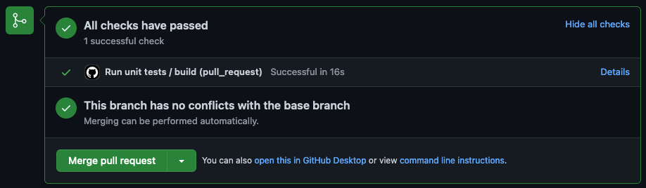

# Wordpress unit tests
Wordpress in it self is unit tested rigorously by the wordpress developers.
Wordpress unit tests on plugins and themes should be done in isolation and not need a Wordpress install to run.

We use [Brain Monkey](https://giuseppe-mazzapica.gitbook.io/brain-monkey/) or [WP_Mock](https://github.com/10up/wp_mock) to mock wordpress functions and classes.  TODO Decide what tool?

## Example test setup


### Folder structure and file name convention
Example folder structure for test and test subjects.
File names for test should be ClassnameTest.php and follow the source folder structure.  
ex.
```
project
│   phpunit.xml   
│
└───test
│   │   autoload.php
│   │
│   └───php
│       │   EditorTest.php
│       │   ModuleTest.php
│       │   ...
│
└───source
    │
    └───php
        │   Editor.php
        │   Module.php
        │   ...
```


#### phpunit.xml
``` xml
<phpunit colors="true"  bootstrap="test/autoload.php">
  <testsuites>
    <testsuite name="test">
      <directory>test/php</directory>
    </testsuite>
  </testsuites>
</phpunit>
```


## Pull Request testing
To indicate test have failed on a Github Pull Request.  
  
Add a Github Action to run the test command on Pull Requests tergeting dev branch.  
`.github/workflow/unit-test.yaml`
```yaml 
name: pull-request
on:
  pull_request:
    branches: [ dev ]

jobs:
  build:
    runs-on: ubuntu-latest
    steps:
      - name: Check out code
      - uses: actions/checkout@v2

      - name: Setup PHP with composer v2
        uses: shivammathur/setup-php@v2
        with:
          php-version: '7.4'
          tools: composer:v2

      - name: Install dependencies
        run: composer install

      - name: Run tests 
        run: ./vendor/bin/phpunit --version
```